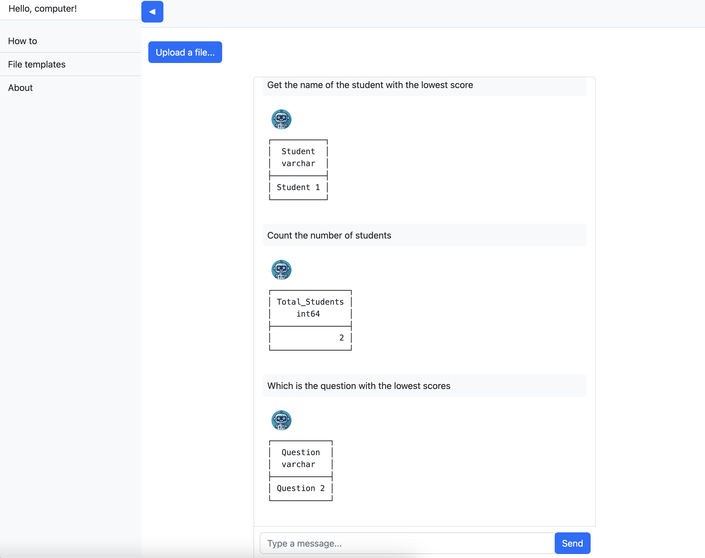

# hellocomputer

[Hello, computer!](https://youtu.be/hShY6xZWVGE?si=pzJjmc492uLV63z-)

`hellocomputer` is a GenAI-powered web application that allows you to analyze spreadsheets 




## Quick install and run

If you have `uv` installed, just clone the repository and run:

```
uv pip install -r requirements.in
```

You'll need the following environment variables in a .env file:

* `GCS_ACCESS`
* `GCS_SECRET`
* `LLM_API_KEY`
* `LLM_BASE_URL`
* `GCS_BUCKETNAME`

And to get the application up and running...

```
uvicorn hellocomputer.main:app --host localhost
```
